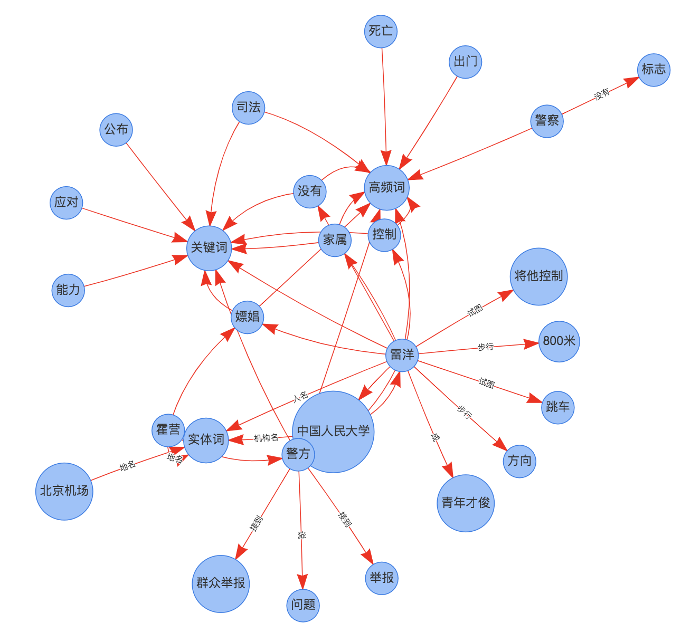

[](https://badge.fury.io/py/relext)
[](CONTRIBUTING.md)
[](https://github.com/shibing624/relext/graphs/contributors)
[](LICENSE)
[](requirements.txt)
[](https://github.com/shibing624/relext/issues)
[](#Contact)

# RelExt
RelExt: Text Relation Extraction toolkit. 文本关系抽取工具。


**Guide**

- [Question](#Question)
- [Solution](#Solution)
- [Feature](#Feature)
- [Install](#install)
- [Usage](#usage)
- [Dataset](#Dataset)
- [Contact](#Contact)
- [Cite](#Cite)
- [Reference](#reference)

# Question

文本关系抽取咋做？

# Solution


文本关系抽取结果为三元组（triple），是一种图数据结构，知识图谱的最小单元，表示两个节点及它们之间的关系，即node1，edge，node2。

语言学上，提取句子主干，如"姚明是李秋平的徒弟"主干为（姚明，徒弟，李秋平），形式化表示为（主语，谓语，宾语），也称为SPO（subject，predicate，object）三元组，还有主谓宾（SVO）三元组（姚明，是，徒弟），均是三元组。

不同结构化程度的文本，关系抽取(三元组抽取)方法不一样：

- 结构化文本：映射规则即可转化为三元组，相对简单，业务依赖强。此处不展开讨论。
- 非结构化文本：关系抽取包括两个子任务，实体识别，实体关系分类。三元组抽取模型分为以下两类，
	1. pipeline模型：先基于序列标注模型识别文本的实体，再用分类器识别实体间的关系。优点：各模型单独训练，模型准确率高，需要训练样本少，
	适合冷启动；缺点：误差传递，实体识别错误会传递到关系抽取过程中，模型分开训练未充分利用实体信息。
	2. 联合（joint）模型：实体识别模型和实体关系分类模型整合到一个模型，共享底层特征、二者损失值联合训练。优点：误差传递小，模型推理快；
	缺点：需要大量训练样本，模型复杂，当前英文公共数据集准确率64%左右。

### 语言学方法

依据语言学的句法依存分析，语义角色分析，实体和核心词分析，抽取文本的实体关系，得到实体关系三元组。

- 基于HanLP的srl语义角色标注分析，抽取句子中的（核心）谓词，施事者，受事者，确定为三元组
- 基于HanLP的dep句法依存分析，抽取主谓宾三元组
- 基于HanLP的ner实体识别，抽取文章实体词
- 基于TextRank图模型抽取文章核心关键词
- 基于文章TF词频抽取高频词

### Pipeline方法

- 实体抽取: 从一个句子中识别出实体词（entity），判断两个实体词是否有关系。参考NER识别任务[NER-models](https://github.com/shibing624/NER-models)
- 实体关系分类: 判断句子中两个entity是哪种关系，属于多分类问题。

主要是解决实体关系分类问题，本质是文本分类问题，网络结构的设计更多是考虑句子中哪些部分对relation label有更大贡献，大体思想如下：

- 基于[Selective Attention](http://nlp.csai.tsinghua.edu.cn/~lyk/publications/acl2016_nre.pdf)引入Attention机制，利用Attention权重对不同bag（数据中包含两个entity的所有句子称为一个Bag）内的句子赋予不同的权重，这样既可以过滤噪声，也可以充分利用信息。
- 基于[Memory Network](https://www.ijcai.org/proceedings/2017/0559.pdf)做关系抽取，考虑句子中不同词对relation label的影响程度不同，以及relation label之间的依赖关系。
- 基于[Bert](https://github.com/yuanxiaosc/Entity-Relation-Extraction/blob/master/Schema%E7%BA%A6%E6%9D%9F%E7%9A%84%E7%9F%A5%E8%AF%86%E6%8A%BD%E5%8F%96%E7%B3%BB%E7%BB%9F%E6%9E%B6%E6%9E%84%EF%BC%88%E2%80%9C%E4%BF%A1%E6%81%AF%E6%8A%BD%E5%8F%96%E2%80%9D%E4%BB%BB%E5%8A%A1%E5%86%A0%E5%86%9B%E9%98%9F%E4%BC%8D%E6%8A%A5%E5%91%8A%EF%BC%89.pdf)模型先做实体识别，然后做实体对关系分类，此处NER识别准确率大概90%左右，还会出现大量无意义实体对，再做存在关系识别，并抽取实体subject和object。

### Joint方法

实体识别与实体关系分类一起做的融合模型：
- Seq2Seq Model
- Transformer


# Feature

### 语言学方法

#### 依存句法的三元组抽取

1. 对句子粗粒度分词，依次对句中各词生成一个该词的依存句法的儿子节点（node），存储节点关系和对应儿子词的位置；
2. 对每个词生成一个该词的父子数组的依存结构，主要是记录该词的词性、父节点的词性以及他们之间的关系；
3. 循环每个词，找到具有动宾关系，并进行提取主谓宾三元组；
4. 过滤，对于提取的主谓宾词，需要在里面寻找具有相关依存结构的词，剔除不需要的词。

#### 语义角色标注的三元组抽取

利用HanLP的语义角色标注（srl）对句子进行标注，统计是否存在施事者，谓词，受事者结构，存在则抽取三元组，否则换依存句法进行抽取。


### Pipeline方法

#### Bert模型

一般事先给定schema，在指定的subject、predicate、object范围内识别句子的三元组。

1. 对文本的所有实体词抽取出来，然后确定句子中存在哪些实体关系，基于Bert多分类模型识别命中的关系概率（各关系互不冲突，使用sigmoid）；
2. 关系元素抽取，枚举第一步预测的每个属性，从句子中标注subject和object，基于Bert的CRF模型输出BIO序列标注预测结果。

### Joint方法

#### Seq2Seq模型

1. 样本：人工标注样本[Baidu Information Extraction](#Baidu Information Extraction)SAOKE数据集，样本量4.6万，人工评估准确率89.5%，召回率92.2%，
2. 模型：训练Seq2Seq的端到端模型[Logician](https://arxiv.org/abs/1904.12535v1),
3. 效果：评估训练的Logician模型，在开放域信息抽取，包括动词介词，名词性短语，描述性短语和上下位关系抽取，paper效果F1：0.431。

# Install

本项目基于 Python 3.6+.

安装：

```
pip3 install relext
```

or

```
git clone https://github.com/shibing624/relext.git
cd relext
python3 setup.py install
```

# Usage
### 语言学方法

实体关系抽取结果是得到三元组（triple）。

示例[base_demo.py](examples/base_demo.py)

```python
import sys

sys.path.append('..')
from relext import RelationExtract

article = """
咸阳市公安局在解放路街角捣毁一传销窝点，韩立明抓住主犯姚丽丽立下二等功。彩虹分局西区派出所民警全员出动查处有功。
          """

m = RelationExtract()
triples = m.extract_triples(article)
print(triples)
```

output:

```
{
'keyword': [['窝点', '', '关键词'], ['传销', '', '关键词'], ['韩立明', '', '关键词'], ['街角', '', '关键词'], ['抓住', '', '关键词'], ['捣毁', '', '关键词'], ['民警', '', '关键词'], ['查处', '', '关键词'], ['出动', '', '关键词'], ['全员', '', '关键词']],
'freq': [['咸阳市公安局', '', '高频词'], ['解放路', '', '高频词'], ['街角', '', '高频词'], ['捣毁', '', '高频词'], ['传销', '', '高频词'], ['窝点', '', '高频词'], ['韩立明', '', '高频词'], ['抓住', '', '高频词'], ['主犯', '', '高频词'], ['姚丽丽', '', '高频词']],
'ner': [['咸阳市公安局', '机构名', '实体词'], ['解放路', '地名', '实体词'], ['韩立明', '人名', '实体词'], ['姚丽丽', '人名', '实体词']],
'coexist': [['姚丽丽', '', '韩立明'], ['姚丽丽', '', '解放路'], ['姚丽丽', '', '咸阳市公安局'], ['韩立明', '', '姚丽丽'], ['韩立明', '', '解放路'], ['韩立明', '', '咸阳市公安局'], ['解放路', '', '姚丽丽'], ['解放路', '', '韩立明'], ['解放路', '', '咸阳市公安局'], ['咸阳市公安局', '', '姚丽丽'], ['咸阳市公安局', '', '韩立明'], ['咸阳市公安局', '', '解放路']],
'ner_keyword': [['姚丽丽', '', '窝点'], ['韩立明', '', '捣毁'], ['韩立明', '', '窝点'], ['咸阳市公安局', '', '窝点'], ['姚丽丽', '', '韩立明'], ['咸阳市公安局', '', '街角'], ['姚丽丽', '', '捣毁'], ['解放路', '', '街角'], ['咸阳市公安局', '', '韩立明'], ['韩立明', '', '街角'], ['解放路', '', '抓住'], ['姚丽丽', '', '传销'], ['解放路', '', '窝点'], ['姚丽丽', '', '街角'], ['咸阳市公安局', '', '传销'], ['姚丽丽', '', '抓住'], ['解放路', '', '捣毁'], ['咸阳市公安局', '', '抓住'], ['咸阳市公安局', '', '捣毁'], ['韩立明', '', '传销'], ['韩立明', '', '抓住'], ['解放路', '', '韩立明'], ['解放路', '', '传销']],
'svo': [['咸阳市公安局', '捣毁', '窝点'], ['韩立明', '抓住', '姚丽丽']],
'event': [['韩立明', '抓住', '主犯姚丽丽'], ['韩立明', '立', '二等功']]}
```

PS:
- event: 施事者，谓语主词，受事者三元组
- svo: 主谓宾三元组
- keyword: 关键词
- freq: 高频词
- ner: 实体词
- coexist: 实体共现词
- ner_keyword: 实体与关键词的关联词


### 深度模型方法

基于深度模型及标注样本训练模型，抽取文本实体间的关系。

示例[deepmodel_demo.py](examples/deepmodel_demo.py)

```python
import sys

sys.path.append('..')
from relext import RelationExtract

article = """
咸阳市公安局在解放路街角捣毁一传销窝点，韩立明抓住主犯姚丽丽立下二等功。彩虹分局西区派出所民警全员出动查处有功。
          """

m = RelationExtract(model_path='')
triples = m.extract_triples(article)
print(triples)
```

### 示例效果

示例[article_triples_demo.py](examples/article_triples_demo.py)

1. 雷洋嫖娼事件


2. 南京胖哥事件


# Dataset

### SemEval 2010 Task 8 数据集

数据样例：

```
The <e1>microphone</e1> converts sound into an electrical <e2>signal</e2>.
Cause-Effect(e1,e2)
Comment:
```
格式：每个case有三行，第一行是sentence，第二行是两个entity的relation，第三行是备注。

### Baidu Information Extraction 数据集

官方下载地址：[Information Extraction](https://ai.baidu.com/broad/download)

数据样例：
```
{
  "natural": "唐娜·凯伦（Donna Karan）出生于纽约长岛，对纽约这个世界大都会有着一份特殊的感悟。",
  "logic": [
    {
      "subject": "唐娜·凯伦",
      "predicate": "出生于",
      "object": [
        "长岛",
        ...
      ]
    },
    {
      "subject": "长岛",
      "predicate": "IN",
      "object": [
        "纽约",
        ...
      ]
    },
    ...
  ]
}
```
# Contact

- Issue(建议)：[](https://github.com/shibing624/relext/issues)
- 邮件我：xuming: xuming624@qq.com
- 微信我：
加我*微信号：xuming624, 备注：个人名称-NLP* 进NLP交流群。


# Cite

如果你在研究中使用了relext，请按如下格式引用：

```latex
@software{relext,
  author = {Xu Ming},
  title = {relext: A Tool for Relation Extraction from Text},
  year = {2021},
  url = {https://github.com/shibing624/relext},
}
```

# License


授权协议为 [The Apache License 2.0](/LICENSE)，可免费用做商业用途。请在产品说明中附加relext的链接和授权协议。


# Contribute
项目代码还很粗糙，如果大家对代码有所改进，欢迎提交回本项目，在提交之前，注意以下两点：

 - 在`tests`添加相应的单元测试
 - 使用`python setup.py test`来运行所有单元测试，确保所有单测都是通过的

之后即可提交PR。


# Reference

- [Lin,(2016). Neural Relation Extraction with Selective Attention over Instances.ACL](http://nlp.csai.tsinghua.edu.cn/~lyk/publications/acl2016_nre.pdf)
- [Feng,(2017). Effective Deep Memory Networks for Distant Supervised Relation Extraction. IJCAI](https://www.ijcai.org/proceedings/2017/0559.pdf)
- [Baidu,(2019). Logician: A Unified End-to-End Neural Approach for Open-Domain Information Extraction](https://arxiv.org/abs/1904.12535v1)
- [Alexander Schutz,(2005). RelExt- A Tool for Relation Extraction from Text in Ontology Extension](https://github.com/shibing624/relext/blob/main/docs/RelExt_paper.pdf)
- [TextGrapher](https://github.com/liuhuanyong/TextGrapher)
- [pytorch-relation-extraction](https://github.com/ShomyLiu/pytorch-relation-extraction)
- [Information-Extraction-Chinese](https://github.com/crownpku/Information-Extraction-Chinese)
- [Entity-Relation-Extraction](https://github.com/yuanxiaosc/Entity-Relation-Extraction)
- [2019语言与智能技术竞赛](http://lic2019.ccf.org.cn/kg)
